# Docker Compose Down Exercise 2 since it also used KAFKA

```bash
docker compose down -v
```

# Start the environment

Download the repository and start the environment:

```bash
docker compose up -d
```

# Create the kafka topic where the log records produced:
```bash
docker exec -it kafka kafka-topics.sh \
  --bootstrap-server localhost:9092 \
  --create \
  --topic logs \
  --partitions 2 \
  --replication-factor 1
```

# Attaching VS Code to the Spark Client container
Spark does **not** run on your host machine; it runs inside Docker containers. Attaching VS Code ensures:

* **Correct Spark version:** (4.0.0)
* **Correct Python environment**
* **Correct Kafka networking**
* **Identical setup for everyone**

> **Note:** VS Code becomes a remote UI for the `spark-client` container.

---

### Prerequisite
Install this VS Code extension on your host:
* **Dev Containers** (Microsoft)

---

### Attach to the running container
1. Open **VS Code**.
2. Open the **Command Palette**:
   * `Ctrl + Shift + P` (Linux/Windows)
   * `Cmd + Shift + P` (macOS)
3. Select: **Dev Containers: Attach to Running Container**.
4. Choose: **spark-client**.

*VS Code will reload automatically.*

---

### Verify attachment
1. Look at the **bottom-left corner** of VS Code. It should display:
   `Dev Container: spark-client`
2. Open a terminal in VS Code and run:
   ```bash
   spark-submit --version
    ```
3. open the folder ```/opt/spark-apps/```

# Understanding the Spark Structured Streaming code
Revise the Spark Structured Streaming application example: ```spark_structured_streaming_logs_processing.py```

# Running the Spark Structured Streaming application

In the spark-client terminal, example of how to run the Spark application:

```bash
spark-submit \
  --master spark://spark-master:7077 \
  --packages org.apache.spark:spark-sql-kafka-0-10_2.13:4.0.0 \
  --num-executors 1 \
  --executor-cores 1 \
  --executor-memory 1G \
  /opt/spark-apps/spark_structured_streaming_logs_processing.py  
```

```bash
┌────────────────────────┐
│    Spark Client        │
│  spark-submit          │
│  (user machine / pod)  │
└───────────┬────────────┘
            │
            │ 1) submit application
            │
            ▼
┌────────────────────────┐
│     Spark Master       │
│  (Cluster Manager)    │
│                        │
│  - registers app       │
│  - allocates workers   │
└───────────┬────────────┘
            │
            │ 2) start executors
            │
   ┌────────┴─────────┬──────────┐
   ▼                  ▼          ▼
┌───────────┐   ┌───────────┐  ┌───────────┐
│ Worker 1  │   │ Worker 2  │  │ Worker N  │
│ Executor  │   │ Executor  │  │ Executor  │
└───────────┘   └───────────┘  └───────────┘
```

See the application submission in the Spark Master: http://localhost:8080
If there are no crashes, the Spark Driver should be reacheable: http://localhost:4040 

Note that the python application stored locally is submitted to the spark master's URL. Also note number of executors, cores per executors, and memory management. 
# Running the logs producer (load generator). This should generate the data that the Spark application processes.


Inside the ```load-generator``` folder, revise the ```docker-compose.yaml``` file, especially the number of messages generated per second. To start the load generator:

```bash
docker compose up -d
```

# Activity 1: Understanding the execution of Spark applications 

**Ilustration:**
```bash
                             +-----------------------+
                             |     Spark Driver      |
                             |----------------------|
                             | - Job scheduling     |
                             | - DAG management     |
                             | - Resource tracking  |
                             +-----------------------+
                                         |
                                         v
                               +-----------------+
                               |   Worker 1      |
                               |-----------------|
                               |  +-----------+  |
                               |  | Executor 1|  |
                               |  |-----------|  |
                               |  | Job 1     |  |
                               |  | Stage 1   |  |
                               |  |  * Task0  |  |
                               |  |  * Task1  |  |
                               |  | Stage 2   |  |
                               |  |  * Task0  |  |
                               |  |  * Task1  |  |
                               |  +-----------+  |
                               +-----------------+
                               +-----------------+
                               |   Worker 2      |
                               |-----------------|
                               |  +-----------+  |
                               |  | Executor 2|  |
                               |  |-----------|  |
                               |  | Job 2     |  |
                               |  | Stage 1   |  |
                               |  |  * Task0  |  |
                               |  |  * Task1  |  |
                               |  | Stage 2   |  |
                               |  |  * Task0  |  |
                               |  |  * Task1  |  |
                               |  +-----------+  |
                               +-----------------+

Kafka Input Topic
+---------------+ +---------------+  +----------------+
|Partition0 (P0)| |Partition1 (P1)|  |Partition2 (P2) |
+---------------+ +---------------+  +----------------+
       |              |              |
       v              v              v
     +-----------------------------------+
     |          Dataflow DAG             |
     |---------------------------------- |
     |Stage 1: Map/Filter/Parse (3 tasks)|
     |  Task0 (P0) -> Shuffle -> Stage2  |
     |  Task1 (P1) -> Shuffle -> Stage2  |
     |  Task2 (P2) -> Shuffle -> Stage2  |
     |                                   |
     |Stage 2: Aggregation/Join (2 tasks)|
     |     * Task0 <- shuffled data      |
     |     * Task1 <- shuffled data      |
     +-----------------------------------+
                    |
                    v
               +-----------+
               |  Sink     |
               |(Kafka,    |
               | HDFS, etc)|
               +-----------+

```
## 1. Accessing the Interface
Once your Spark application is running, the Web UI is hosted by the **Driver**: http://localhost:4040 

---

## 2. Key Concepts to Observe
As you navigate the UI, find and analyze the following sections to see Spark theory in action:

### A. The Jobs Tab & DAG Visualization
Every **Action** (like `.count()`, `.collect()`, or `.save()`) triggers a Spark Job. 
* **Task:** Click on a Job ID to see the **DAG Visualization**.
* **Concept:** Observe how Spark groups operations. Transformations like `map` or `filter` stay in one stage, while `sort` or `groupBy` create new stages.

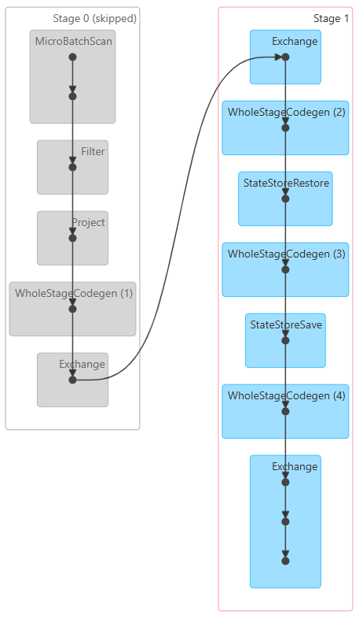


### B. The Stages Tab
Stages represent a set of tasks that can be performed in parallel without moving data between nodes.
* **Concept:** Look for **Shuffle Read** and **Shuffle Write**. This represents data moving across the network—the most "expensive" part of distributed computing.


### C. The Executors Tab
This shows the "Workers" doing the actual computation.
* **Concept:** Check for **Data Skew**. If one executor has 10GB of Shuffle Read while others have 10MB, your data is not partitioned evenly.

I only have one worker and one driver so i cannot see data skew in this example.

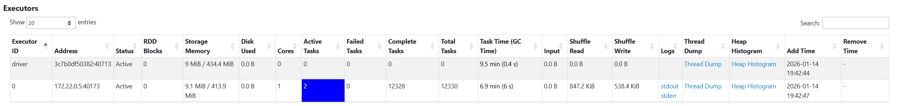
---

## 3. Practical Exploration Questions
While your application is running, try to answer these questions:
1.  **The Bottleneck:** Which Stage has the longest "Duration"? What are the technical reasons for it?

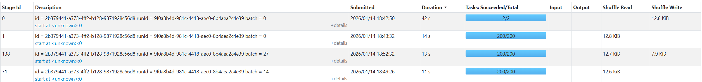

Stage 0 has the longest duration at 42 seconds, compared to 5-10 seconds for other stages. This is likely due to the initial data ingestion and parsing from Kafka. Stage 0 must read from all Kafka partitions, deserialize records, and apply filtering/transformation logic before passing data to downstream stages. With limited executor resources (1 executor, 1 core), all this work is serialized on a single task, creating a bottleneck. Subsequent stages are faster because they operate on already-processed, smaller datasets.

2.  **Resource Usage:** In the Executors tab, how much memory is currently being used versus the total capacity?

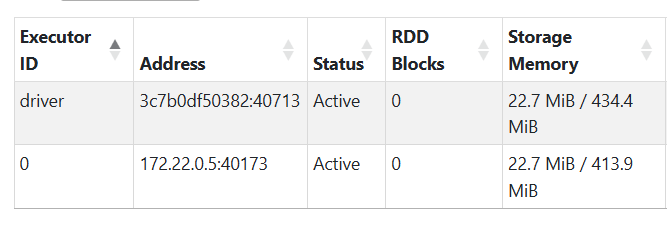

the current memory used is 22.7 MiB out of 434.4 MiB total capacity

3. **Explain with your own words the main concepts related to performance and scalability in Spark Structured Streaming.**

Performance in Spark Structured Streaming depends on three key factors: **parallelism** (using multiple executors and cores to process data simultaneously), **resource allocation** (matching CPU cores and memory to your workload), and **data distribution** (ensuring data is evenly split across partitions to avoid bottlenecks). Scalability requires monitoring the input vs. processing rate—if processing lags behind input, you need more resources. Shuffle operations are expensive because they redistribute data across the network, so minimizing unnecessary shuffles improves performance.


# Activity 2: Tuning for High Throughput

### The Challenge
Your goal is to scale your application to process **several hundred thousand events per second are processed with batch sizes under 20 seconds to maintain reasonable event latency and data freshness**. On a standard laptop (8 cores / 16 threads), it is possible to process **1 million records per second** with micro-batch latencies staying below 12 seconds. 

Please note that the ```TARGET_RPS=10000``` configuration in the docker compose file of the load generator. This value represents how many records per second each instance of the load generator should produce. The load generator can also run in parallel with multiple docker instances to increase the generation speed.

### The Baseline Configuration
Review the starting configuration below. Identify which parameters are limiting the application's ability to use your hardware's full potential: 

From the previous example of how to run the Spark application:

```bash
spark-submit \
   --master spark://spark-master:7077 \
   --packages org.apache.spark:spark-sql-kafka-0-10_2.13:4.0.0 \
   --num-executors 1 \  # Limiting parallelism
   --executor-cores 1 \  # Limiting parallelism
   --executor-memory 1G \  # May not be sufficient for larger workloads
   /opt/spark-apps/spark_structured_streaming_logs_processing.py  
```

To fully utilize your hardware, consider increasing the `--num-executors` and `--executor-cores` parameters based on the available CPU cores and memory. This will allow for better parallel processing and improved performance.


### Tuning Configurations (The "Knobs")
You must decide how to adjust the configurations to increase the performance. Consider the relationship between your **CPU threads**, **RAM availability**, and **Parallelism**. Examples of configurations

| Parameter | Impact on Performance |
| :--- | :--- |
| `--num-executors` | Defines how many parallel instances (executors) run. |
| `--executor-cores` | Defines how many tasks can run in parallel on a single executor. |
| `--executor-memory` | Affects the ability to handle large micro-batches and shuffles in RAM. |
| `--conf "spark.sql.shuffle.partitions=2"` | Controls how many partitions are created during shuffles. |

### Simple Tuning Strategy
For an 8-core laptop with 16GB RAM, replace the baseline configuration:

**Before (Baseline):**
```bash
--num-executors 1 --executor-cores 1 --executor-memory 1G
```

**After (Optimized):**
```bash
--num-executors 1 --executor-cores 8 --executor-memory 3G \
--conf "spark.sql.shuffle.partitions=8"
```


**Why this works:**
- **1 executor × 8 cores = 8 parallel tasks** (uses your 8 cores efficiently)
- **3GB per executor** lets you process larger batches without memory errors
- **8 shuffle partitions** (not 200) reduces overhead on a single machine

This should improve Stage 0 duration from ~42 seconds to ~5-10 seconds.


```bash
spark-submit \
   --master spark://spark-master:7077 \
   --packages org.apache.spark:spark-sql-kafka-0-10_2.13:4.0.0 \
   --num-executors 1 \
   --executor-cores 8 \
   --executor-memory 3G \
   --conf "spark.sql.shuffle.partitions=8" \
   /opt/spark-apps/spark_structured_streaming_logs_processing.py  
```

---

See full configuration: https://spark.apache.org/docs/latest/submitting-applications.html and general configurations: https://spark.apache.org/docs/latest/configuration.html. Also check possible configurations with:

   ```bash
   spark-submit --help
   ```

### Monitoring 
Navigate to the **Structured Streaming Tab** in the UI to monitor the performance:

####  * **Input Rate vs. Process Rate:** 
If your input rate is consistently higher than your process rate, your application is failing to keep up with the data stream.

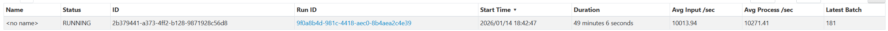

my avg input rate is a bit lower than my avg process rate, so the application is keeping up with the data stream.

#### The Executors Tab
In the The Executors Tab, check the **"Thread Dump"** and **"Task"** columns to verify resource utilization.

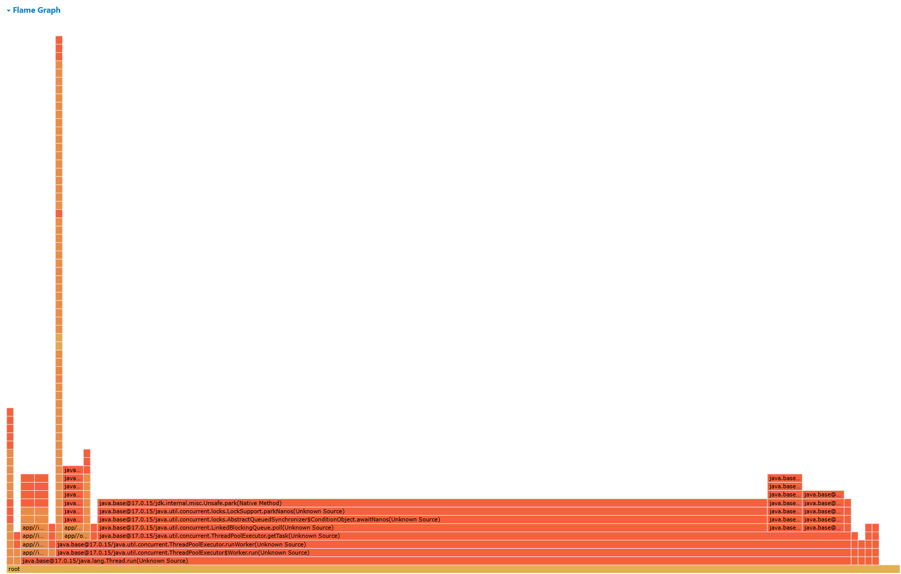

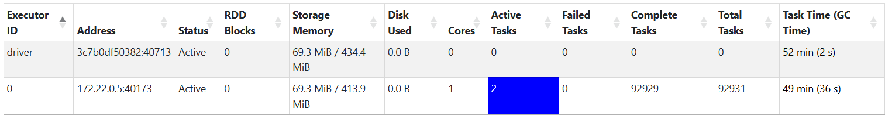

#### The SQL/Queries Tab
Click on the active query to see the **DAG (Directed Acyclic Graph)**.

* **Identify "Shuffle" Boundaries:** Look for the exchange points where data is redistributed across the cluster.

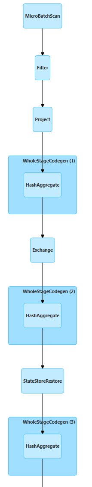


* **Identify Data Skew:** Is data being distributed evenly across all your cores, or are a few tasks doing all the work? Use the DAG to pinpoint which specific transformation is causing a bottleneck.

go to one query and then to its subqueries:

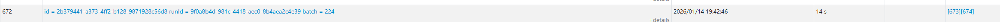

look at succeeded jobs: 

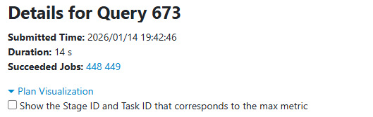

look if durations are the same or if one is much higher than the other:

job 448:


job 449:

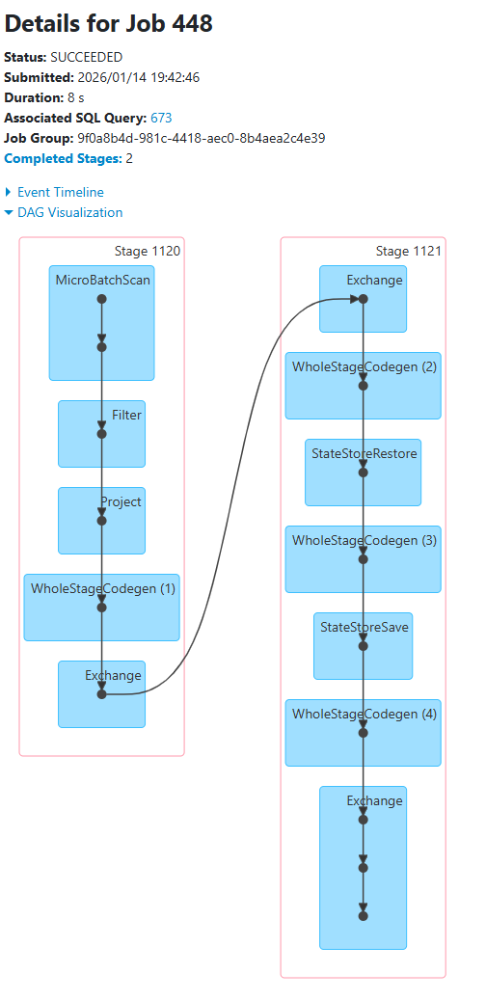

* **Submit activities 1 and 2 (answers and evidences) via Moodle until 20.01.2026**