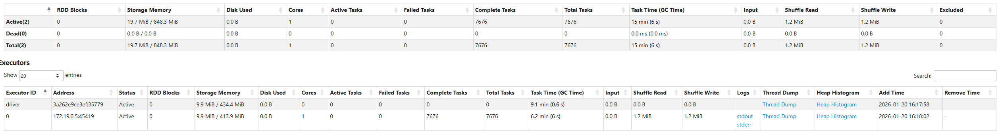
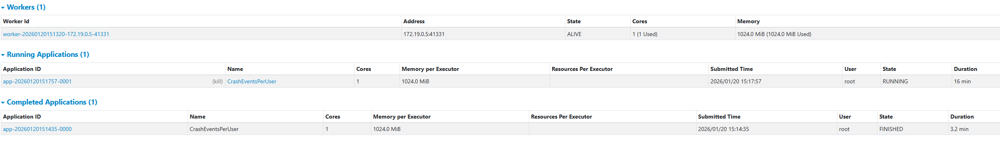

# Activity 3 - Monitoring user experience in near real-time
## Technical Specification: Event Aggregation Logic

### Scenario: Continuous reporting of critical crash events

**Given** a stream of incoming event logs  
**When** a log entry has a `content` field containing the substring "crash"  
**And** the `severity` value is either "High" or "Critical"  
**And** logs are grouped by the `user_id` field, such as the crash count per `user_id`
**And** the system aggregates these occurrences in **10-second intervals** based strictly on the event `timestamp` field  
**Then** the system must output the aggregated results for each interval as they complete **When** the crash count of a given `user_id` is higher than 2 per interval.

#### Implementation Notes:
* Ensure the search for "crash" handles case sensitivity according to project standards.
* The 10-second interval logic must be tied to the record's metadata (`timestamp`), not the system arrival time.

#### Example of output
   ```bash
-------------------------------------------
Batch: 12
-------------------------------------------
+------------------------------------------+---------+-----------+
|Interval                                  |user_id  |crash_count|
+------------------------------------------+---------+-----------+
|{2026-01-11 14:42:50, 2026-01-11 14:43:00}|user_1836|5          |
|{2026-01-11 14:42:50, 2026-01-11 14:43:00}|user_1184|3          |
|{2026-01-11 14:42:50, 2026-01-11 14:43:00}|user_1946|3          |
|{2026-01-11 14:42:50, 2026-01-11 14:43:00}|user_1551|3          |
|{2026-01-11 14:42:50, 2026-01-11 14:43:00}|user_1841|3          |
|{2026-01-11 14:42:50, 2026-01-11 14:43:00}|user_1287|3          |
|{2026-01-11 14:42:50, 2026-01-11 14:43:00}|user_1028|3          |
|{2026-01-11 14:42:50, 2026-01-11 14:43:00}|user_1288|3          |
+------------------------------------------+---------+-----------+
```

## 2. Non-Functional Requirements
* **Scalability:** The architecture must support horizontal scaling, allowing the logic to be distributed across a cluster of multiple machines.
* **Fault Tolerance:** The system must support recovery in the event of infrastructure failure of the worker nodes.

## Deliverables for Activity 3

You are required to submit your application source code accompanied by a technical discussion. This discussion must explain how your specific implementation satisfies the requirements, including a discussion on your solution could handle the scenario of late-arriving records that can appear after a 10-second interval has concluded. Furthermore, you must provide a performance and scalability report that evaluates the performance and efficiency of your solution and discuss its ability to execute effectively across a multi-machine environment. Submit via Moodle until 27.01.2026

# Delete the topic where the log records were produced:
```bash
docker exec -it kafka kafka-topics.sh \
  --bootstrap-server localhost:9092 \
  --delete \
  --topic logs 
```


## Clean up the ```load-generator``` folder under ```logs-processing```.
```bash
docker compose down -v
```

Code Change:
```python
from pyspark.sql import SparkSession
from pyspark.sql.functions import (
    col, from_json, lower, count, window, to_timestamp
)
from pyspark.sql.functions import from_unixtime
from pyspark.sql.types import StructType, StructField, StringType, LongType

# 1. Configuration & Session Setup
CHECKPOINT_PATH = "/tmp/spark-checkpoints/activity3-logs-processing"

spark = (
    SparkSession.builder
    .appName("CrashEventsPerUser")
    .config("spark.sql.streaming.checkpointLocation", CHECKPOINT_PATH)
    .getOrCreate()
)

spark.sparkContext.setLogLevel("ERROR")

# 2. Define schema (event timestamp is epoch seconds)
schema = StructType([
    StructField("timestamp", LongType()),
    StructField("status", StringType()),
    StructField("severity", StringType()),
    StructField("source_ip", StringType()),
    StructField("user_id", StringType()),
    StructField("content", StringType())
])

# 3. Read stream from Kafka
raw_df = (
    spark.readStream
    .format("kafka")
    .option("kafka.bootstrap.servers", "kafka:9092")
    .option("subscribe", "logs")
    .option("startingOffsets", "earliest")
    .option("failOnDataLoss", "false")
    .load()
)

# 4. Parse JSON and convert event-time timestamp
parsed_df = (
    raw_df
    .select(from_json(col("value").cast("string"), schema).alias("data"))
    .select("data.*")
    # Convert epoch seconds → Spark timestamp (EVENT TIME)
    .withColumn(
        "event_time",
        # timestamp is epoch seconds -> convert to Spark timestamp
        to_timestamp(from_unixtime(col("timestamp")))
    )
)

# 5. Filter crash events (case-insensitive) and severity
filtered_df = (
    parsed_df.filter(
        (lower(col("content")).contains("crash")) &
        (col("severity").isin("High", "Critical"))
    )
)

# 6. Event-time windowed aggregation (10 seconds) with watermark
aggregated_df = (
    filtered_df
    .withWatermark("event_time", "30 seconds")
    .groupBy(
        window(col("event_time"), "10 seconds"),
        col("user_id")
    )
    .agg(count("*").alias("crash_count"))
)

# For debugging/visibility emit all windowed counts (adjust threshold as needed)
alerts_df = aggregated_df

# 8. Write results when windows complete
query = (
    alerts_df.writeStream
    .outputMode("update")
    .format("console")
    .option("truncate", "false")
    .option("numRows", 50)
    .option("checkpointLocation", CHECKPOINT_PATH)
    .trigger(processingTime="10 seconds")
    .start()
)

query.awaitTermination()
```

output:
```bash
-------------------------------------------
Batch: 0
-------------------------------------------
+----------------------------------------------+---------+-----------+
|window                                        |user_id  |crash_count|
+----------------------------------------------+---------+-----------+
|{+58024-11-28 06:53:50, +58024-11-28 06:54:00}|user_1125|1          |
|{+58024-11-28 09:08:10, +58024-11-28 09:08:20}|user_1382|1          |
|{+58024-11-28 12:27:00, +58024-11-28 12:27:10}|user_1895|1          |
|{+58024-11-28 13:33:40, +58024-11-28 13:33:50}|user_1261|1          |
|{+58024-11-28 14:07:10, +58024-11-28 14:07:20}|user_1713|1          |
|{+58024-11-28 20:46:30, +58024-11-28 20:46:40}|user_1528|1          |
|{+58024-11-29 05:07:00, +58024-11-29 05:07:10}|user_1367|1          |
|{+58024-11-29 06:47:30, +58024-11-29 06:47:40}|user_1828|1          |
|{+58024-11-29 09:33:10, +58024-11-29 09:33:20}|user_1719|1          |
|{+58024-11-29 10:40:20, +58024-11-29 10:40:30}|user_1225|1          |
|{+58024-11-29 13:26:40, +58024-11-29 13:26:50}|user_1903|1          |
|{+58024-11-29 16:13:20, +58024-11-29 16:13:30}|user_1187|1          |
|{+58024-11-30 03:53:40, +58024-11-30 03:53:50}|user_1385|1          |
|{+58024-11-30 08:53:30, +58024-11-30 08:53:40}|user_1843|1          |
|{+58024-11-30 09:27:20, +58024-11-30 09:27:30}|user_1211|1          |
|{+58024-11-28 09:07:00, +58024-11-28 09:07:10}|user_1815|1          |
|{+58024-11-28 13:33:50, +58024-11-28 13:34:00}|user_1709|1          |
|{+58024-11-28 16:20:20, +58024-11-28 16:20:30}|user_1780|1          |
|{+58024-11-28 20:14:10, +58024-11-28 20:14:20}|user_1569|1          |
|{+58024-11-28 23:00:40, +58024-11-28 23:00:50}|user_1340|1          |
|{+58024-11-28 23:33:10, +58024-11-28 23:33:20}|user_1773|1          |
|{+58024-11-29 05:40:00, +58024-11-29 05:40:10}|user_1694|1          |
|{+58024-11-29 06:13:30, +58024-11-29 06:13:40}|user_1893|1          |
|{+58024-11-29 17:53:10, +58024-11-29 17:53:20}|user_1885|1          |
|{+58024-11-29 21:13:10, +58024-11-29 21:13:20}|user_1687|1          |
|{+58024-11-29 22:53:20, +58024-11-29 22:53:30}|user_1704|1          |
|{+58024-11-30 01:40:40, +58024-11-30 01:40:50}|user_1342|1          |
|{+58024-11-30 11:06:50, +58024-11-30 11:07:00}|user_1845|1          |
|{+58024-11-28 05:17:20, +58024-11-28 05:17:30}|user_1397|1          |
|{+58024-11-28 05:47:50, +58024-11-28 05:48:00}|user_1449|1          |
|{+58024-11-28 06:53:20, +58024-11-28 06:53:30}|user_1773|1          |
|{+58024-11-28 08:34:10, +58024-11-28 08:34:20}|user_1420|1          |
|{+58024-11-28 14:06:40, +58024-11-28 14:06:50}|user_1432|1          |
|{+58024-11-28 15:13:50, +58024-11-28 15:14:00}|user_1516|1          |
|{+58024-11-29 17:53:50, +58024-11-29 17:54:00}|user_1984|1          |
|{+58024-11-29 22:20:10, +58024-11-29 22:20:20}|user_1569|1          |
|{+58024-11-30 01:06:30, +58024-11-30 01:06:40}|user_1589|1          |
|{+58024-11-30 04:26:40, +58024-11-30 04:26:50}|user_1675|1          |
|{+58024-11-30 08:19:50, +58024-11-30 08:20:00}|user_1670|1          |
|{+58024-11-30 08:20:00, +58024-11-30 08:20:10}|user_1217|1          |
|{+58024-11-30 12:13:10, +58024-11-30 12:13:20}|user_1722|1          |
|{+58024-11-30 12:13:10, +58024-11-30 12:13:20}|user_1288|1          |
|{+58024-11-28 05:00:40, +58024-11-28 05:00:50}|user_1308|1          |
|{+58024-11-28 09:40:00, +58024-11-28 09:40:10}|user_1199|1          |
|{+58024-11-28 18:33:40, +58024-11-28 18:33:50}|user_1594|1          |
|{+58024-11-28 21:54:10, +58024-11-28 21:54:20}|user_1176|1          |
|{+58024-11-28 23:33:10, +58024-11-28 23:33:20}|user_1318|1          |
|{+58024-11-29 00:40:30, +58024-11-29 00:40:40}|user_1095|1          |
|{+58024-11-29 01:13:10, +58024-11-29 01:13:20}|user_1732|1          |
|{+58024-11-29 06:46:20, +58024-11-29 06:46:30}|user_1281|1          |
+----------------------------------------------+---------+-----------+
only showing top 50 rows
```


**Technical discussion**
- Implementation: `logs-processing/spark_structured_streaming_logs_processing.py` implements the pipeline.
- Requirements covered: detects "crash" (case-insensitive) and `severity` in {High,Critical}; converts epoch `timestamp` → event-time; groups by `user_id` in 10s event-time windows; computes per-window `crash_count`.


**Late-arriving records**
- We use `withWatermark(event_time, '30 seconds')`. Events arriving within 30s of their event-time update the 10s window; events later than 30s are excluded. For stricter correctness increase the watermark or run periodic backfill/reconciliation using stored raw events.

**Performance & scalability (short)**
- Scale by increasing Kafka partitions and Spark executors; partitioning by `user_id` spreads work.
- Tune `spark.sql.shuffle.partitions`, allocate executor memory for state, and use durable checkpoint storage.
- Use a production sink (Kafka/Parquet/DB) instead of console for throughput and durability.

The Spark Structured Streaming application reads logs from Kafka, filters "crash" events with High or Critical severity, and aggregates them by user_id in 10-second event-time windows. Late events are handled with a 30-second watermark, allowing updates to recent windows while preventing unbounded state growth. Checkpointing ensures fault tolerance, and the pipeline can scale by increasing Kafka partitions and Spark executors.

Scalability: The pipeline can handle more data by adding Spark executors and Kafka partitions, so work is spread across the cluster.

Fault Tolerance: Spark uses checkpointing to recover state if a worker or driver fails, ensuring no crash counts are lost.






